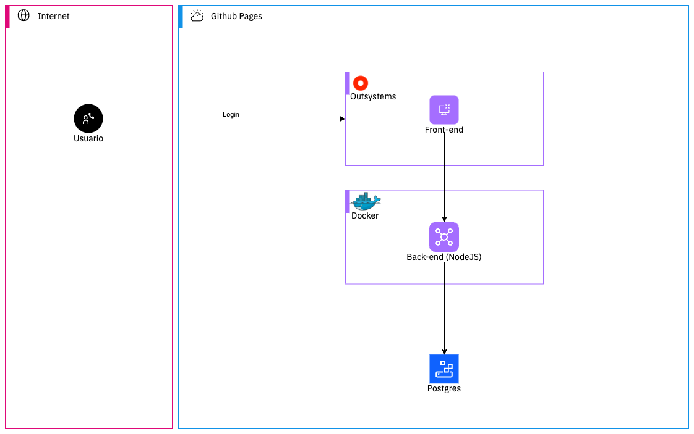
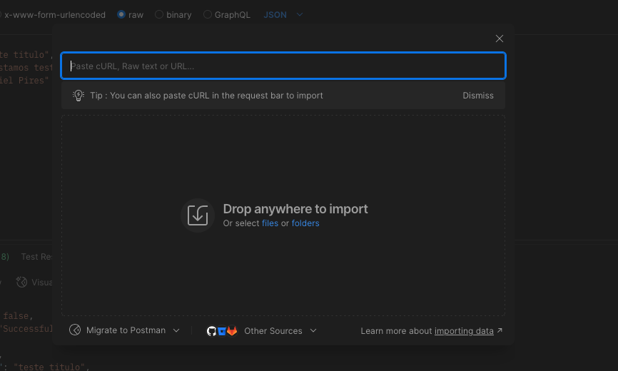
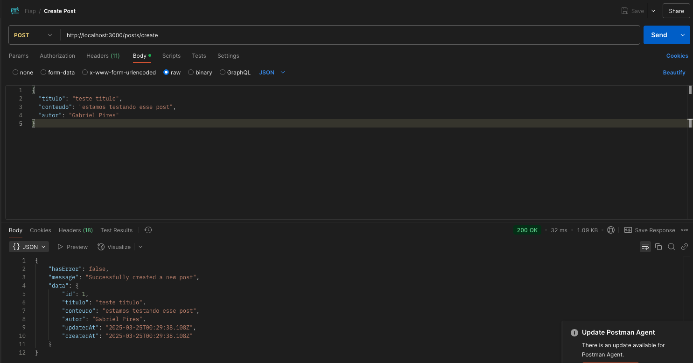
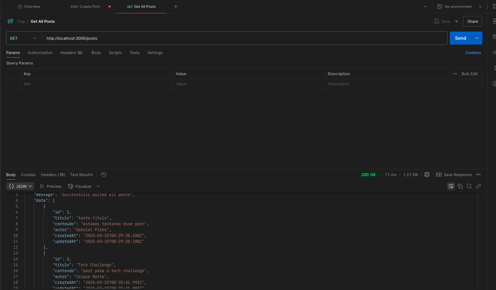
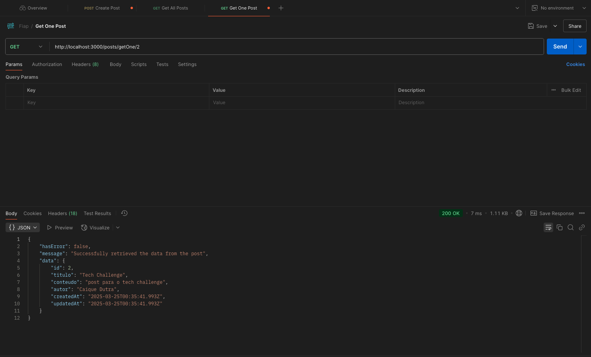
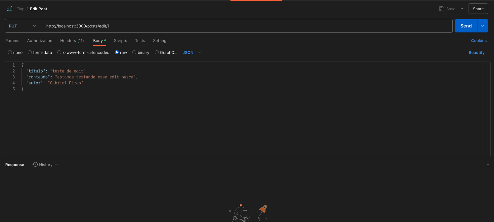
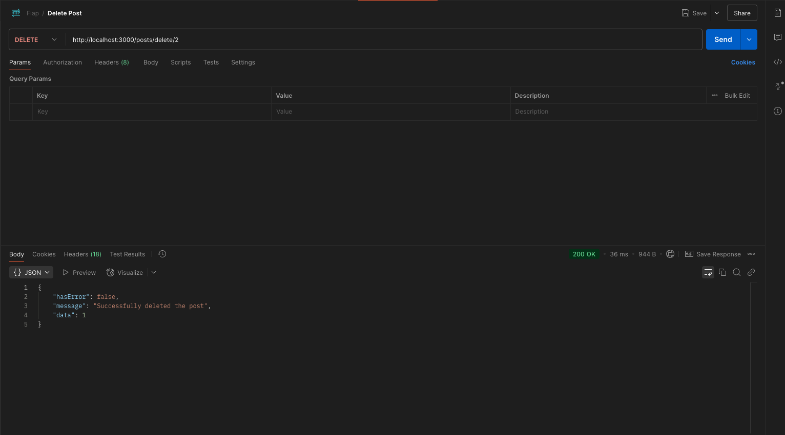
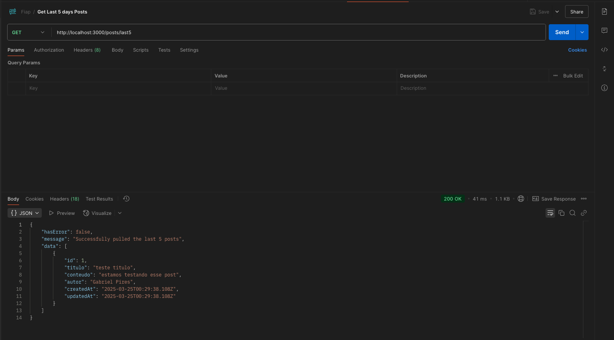
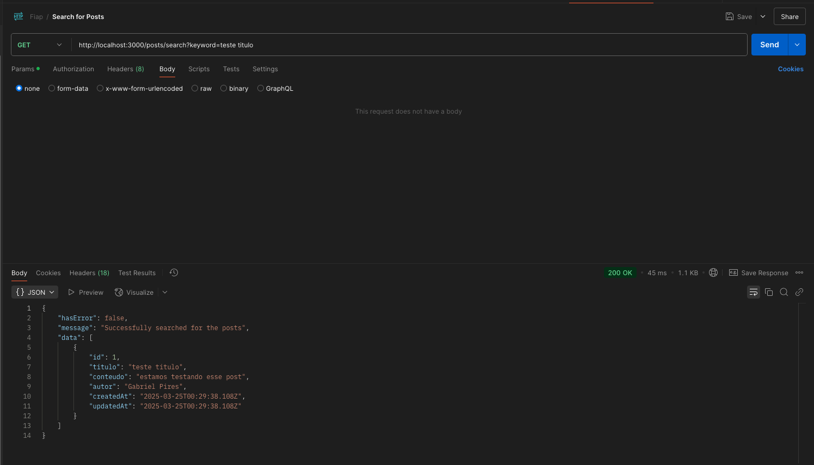

<a id="readme-top"></a>

<br />
<div align="center">
  <h1 align="center">TECH CHALLENGE - FASE 2 - 4FSDT
 </h1>
  <br />
</div>
<details>
  <summary>Conteúdo da Documentação</summary>
  <ol>
    <li>
      <a href="#sobre-o-projeto">Sobre o projeto</a>
      <ul>
        <li><a href="#built-with">Built With</a></li>
      </ul>
    </li>
    <li><a href="#arquitetura">Arquitetura</a></li>
    <li>
      <a href="#como-comecar">Como Começar</a>
      <ul>
        <li><a href="#pre-requisitos">Pre-requisitos</a></li>
        <li><a href="#instalacao">Instalacao</a></li>
      </ul>
    </li>
    <li><a href="#experiencia-e-fluxo-de-trabalho">Experiência e fluxo de trabalho</a></li>
    <li><a href="#desenvolvedores">Desenvolvedores</a></li>
  </ol>
</details>

## Sobre o projeto

### Desafio:

Atualmente, a maioria de professores e professoras da rede pública de
educação não têm plataformas onde postar suas aulas e transmitir conhecimento
para alunos e alunas de forma prática, centralizada e tecnológica.

### Solução

A solução proposta consiste em uma plataforma para gestão de postagens educacionais, com a implementação de uma série de APIs para criação, edição, exclusão e busca de conteúdo. O back-end é desenvolvido em Node.js utilizando o framework Express, permitindo a criação de endpoints RESTful para manipulação de postagens. O banco de dados Postgres é utilizado para persistência dos dados, com modelos adequados para as postagens. A aplicação é containerizada com Docker, garantindo consistência entre os ambientes de desenvolvimento e produção. A automação de testes e deploy é realizada com GitHub Actions, e a cobertura de testes unitários atinge 20% do código. A plataforma permite uma gestão eficiente de conteúdo educacional para professores, com acesso fácil para alunos.

<p align="right">(<a href="#readme-top">back to top</a>)</p>

### Built With

- [NodeJS][Node-url]
- [Postgres][Postgres-url]

<p align="right">(<a href="#readme-top">back to top</a>)</p>

## Arquitetura

<div align="center">
  
</div>

## Como Comecar

Este é um exemplo de como você pode dar instruções sobre como configurar seu projeto localmente.
Para obter uma cópia local instalada e funcionando, siga estas etapas simples de exemplo.

## Pre-requisitos

- NodeJS
- Docker
- Git
- Postman

## Instalacao

1. Clone o repositório
   ```sh
   https://github.com/Caique22/tech-challange-back-qa
   ```
2. Instale o Postgres usando o Docker
   ```sh
   podman run -p 5432:5432 -d -e POSTGRES_PASSWORD=password postgres
   ```
2. Instale as dependencias

   ```sh
   npm install
   ```

3. Crie um arquivo .env com as variáveis preenchidas listadas em [.env-example](.env.example).

4. Rode a aplicação

   ```bash
   npm start
   ```

5. Baixe o arquivo [postman.json](postman.json)

### Testando as API's

1- Faça o upload do arquivo no seu Postman
<br />
  
<br />

2- Crie 1 ou mais posts usando o endpoint /POST

| Metodo | Endpoint      |
| ------ | ------------- |
| POST   | /create/posts |

  

<br />

3- Visualize todos os posts usando o endpoint /GET /posts

| Metodo | Endpoint |
| ------ | -------- |
| GET    | /posts   |

  
<br />

4- Visualize um post específico.

| Metodo | Endpoint         |
| ------ | ---------------- |
| GET    | /posts/getOne/id |

  
<br />

5- Atualize um post específico.

| Metodo | Endpoint       |
| ------ | -------------- |
| PUT    | /posts/edit/id |

  
<br />

6- Delete um post específico.

| Metodo | Endpoint         |
| ------ | ---------------- |
| DELETE | /posts/delete/id |

  
<br />

7- Visualize os últimos 5 posts.

| Metodo | Endpoint     |
| ------ | ------------ |
| GET    | /posts/last5 |

  
<br />

8- Busque por palavras chaves.

| Metodo | Endpoint               |
| ------ | ---------------------- |
| GET    | /posts/search?keyword= |

  

## Experiencia e fluxo de trabalho

O projeto foi dividido nas seguintes etapas:
1. Planejamento:
- Reunião inicial para discussão da abordagem e distribuição de tarefas.
- Organização das tarefas em um Monday
2. Desenvolvimento
- Desenvolvimento da API
- Desenvolvimento dos testes unitários
- Criação de scripts para containerização
3. Documentação
- Elaboração da documentação e diagrama de arquitetura
4. Apresentação:
- Gravação do vídeo explicativo

Dificuldades enfrentadas:
Utilização de bibliotecas que não conhecíamos para criação de testes unitários
Criação de scripts para integração com GitHub Actions, pois o grupo nunca tinha tido contato com essa tecnologia específica.

## Desenvolvedores

| Name                          | RM                  |
| ----------------------------- | ------------------- |
| <h3>Gabriel Pires </h3>       | <h3> RM360472       |
| <h3>Caique Dutra Santos </h3> | <h3> RM360210 </h3> |

[Node-url]: https://nodejs.org/en
[Postgres-url]: https://www.postgresql.org/
[Node]: https://img.shields.io/badge/Node-js-green
